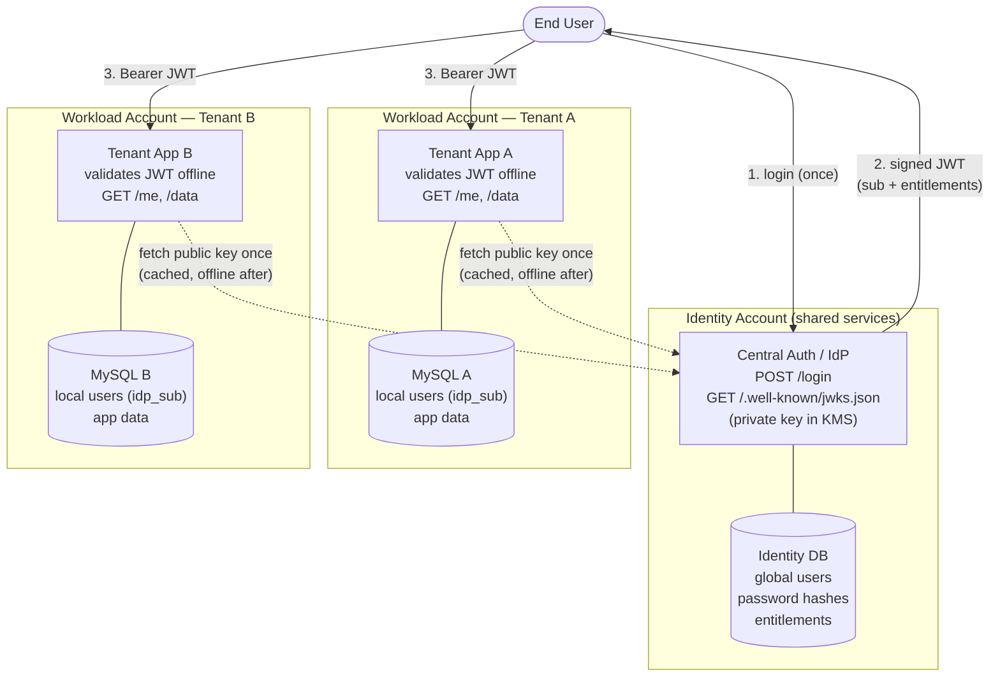

# Architecture — Single Point of Authentication

## 1. Problem

A multi-tenant SaaS runs each customer in its own AWS account: its own ALB, PHP/Apache fleet
(ECS on EC2), and MySQL with a local `users` table. **Authentication is application-managed** —
each tenant's PHP app validates credentials against its *own* `users` table, and sessions live
in the PHP/Apache layer inside the container. There is no shared identity layer.

Consequence: a person who works across three customer sites needs **three accounts, three
passwords, three login URLs**.

**Goal:** one login that grants access to every tenant the user is entitled to, *without*
weakening tenant data isolation.

## 2. Core principle

> **Centralize *authentication*. Keep *authorization* local.**

A central **Identity Provider (IdP)** proves *who the user is* and what tenants they may access.
Each **tenant** independently decides *what the user can do* against *its own* data. The IdP
never touches tenant business data; tenants never authenticate users themselves.

## 3. Where identity lives — before vs. after

| | **Before (today)** | **After (this design)** |
|---|---|---|
| Credentials | Duplicated per tenant `users` table | Central IdP (one record per human) |
| Password verification | Each tenant's PHP app | Central IdP only |
| Session | PHP/Apache container, per tenant | Stateless **JWT** held by the client |
| Cross-tenant link | None | `entitlements` claim in the token |
| Tenant's role | Authenticate **+** authorize | **Authorize + resolve only** |

The tenant keeps its own `users` rows for *local* identity (profile, local roles, FK
relationships), gaining one new column — `idp_sub` — that links the local row to the global
identity. Authorization logic inside the tenant is unchanged.

## 4. Component diagram



## 5. The credential (JWT)

The IdP issues a short-lived JWT signed with **RS256** (asymmetric — see [ADR-0003](adr/0003-rs256-asymmetric-signing.md)).

```jsonc
{
  "iss": "https://auth.platform.example",   // issuer — checked by tenant
  "aud": "platform-tenants",                // audience — checked by tenant
  "sub": "u_8f3a...",                        // stable GLOBAL user id
  "iat": 1700000000,
  "exp": 1700000900,                         // short TTL (~5–15 min)
  "jti": "tok_4b1c...",                      // unique id (future revocation)
  "entitlements": {                          // which tenants + roles
    "tenant_a": ["member"],
    "tenant_b": ["admin"]
  }
}
```

Why embed entitlements rather than call the IdP per request? See [ADR-0002](adr/0002-jwt-embedded-entitlements-offline-validation.md).
The tenant trusts the **signature**, not the IdP's network availability.

## 6. Request validation at the tenant (per request, offline)

```
1. Extract `Authorization: Bearer <jwt>`        → 401 if missing/malformed
2. Verify signature with cached JWKS public key,
   algorithm PINNED to ["RS256"]                 → 401 (rejects alg:none / HS256 confusion)
3. Check exp / nbf (±60s skew), iss, aud         → 401 on mismatch/expiry
4. Check entitlements contains THIS tenant_id     → 403 if absent  (ISOLATION INVARIANT)
5. Resolve sub → local users row via idp_sub      → 403 if no local mapping
6. Serve request against THIS tenant's DB only     → 200
```

**Isolation invariant:** *a token whose `entitlements` does not name tenant X MUST NOT read
tenant X's data.* This is enforced at step 4 and is the single most important test.

## 7. Trust boundaries

```
        ┌─────────────────────────────────────────────┐
        │  Trust ANCHOR: IdP private signing key (KMS)  │
        └───────────────────┬─────────────────────────┘
                            │ signs tokens
              ┌──────────────┴──────────────┐
              ▼                              ▼
        ┌───────────┐                  ┌───────────┐
        │ Tenant A  │   NO mutual      │ Tenant B  │
        │           │  ◄──trust──X──►  │           │
        └───────────┘                  └───────────┘
   trusts IdP signature           trusts IdP signature
   never trusts Tenant B          never trusts Tenant A
```

- **IdP is the root of trust.** Its private key signs every token and lives in KMS — it never
  leaves the identity account. Compromise of any tenant cannot forge a token.
- **Tenants do not trust each other.** A token scoped to tenant A is rejected by tenant B via
  the `aud` + `entitlements` checks. Each tenant only ever queries its own database.
- **One-way trust IdP → tenant.** Tenants *verify* tokens (need only the public key); the IdP
  does not need to trust or call tenants. The IdP holds authentication secrets, never tenant
  business data.

## 8. Availability — what fails open vs. closed

See [ADR-0004](adr/0004-availability-fail-open-closed.md).

| Scenario | Behavior | Rationale |
|---|---|---|
| IdP down, user has a valid token | **Works** (fail open) | Validation is offline via cached public key — in-flight traffic is unaffected |
| IdP down, token expired / new login | **Blocked** (fail closed) | Identity cannot be minted without the IdP; never invent identity |
| Tenant boots while IdP unreachable | Serves from baked/cached key | Must not crash; degrade to cached key |

Net: IdP availability gates *new* authentication, not steady-state request validation.

## 9. SSO flow (production) vs. prototype

- **Production:** OIDC authorization-code flow. Unauthenticated hit on tenant A → redirect to
  `auth.platform.example` → user logs in once (SSO cookie on the auth domain) → redirect back
  with a code exchanged for a token. Visiting tenant B silently re-auths against the existing
  SSO session → **one login, many tenants**. Production may use AWS Cognito / managed OIDC.
- **Prototype:** the minimal core of the same trust model — `POST /login` returns a JWT, the
  client presents it as a bearer token to each tenant. Same signature/entitlement/isolation
  semantics, without browser redirects. (Scope decision in [ADR-0006](adr/0006-prototype-scope.md).)

## 10. AWS placement

The IdP lives in a **dedicated identity / shared-services account** inside the AWS Organization
— deliberately *outside* every tenant workload account, so no single tenant can reach the
signing key. CloudFront fans out to per-tenant ALBs as today; the IdP gets its own subdomain.
The signing key is managed by **KMS**; the public key is published at a JWKS endpoint that
tenants cache.

## 11. Decisions index (ADRs)

| ADR | Decision |
|---|---|
| [0001](adr/0001-centralize-authentication-local-authorization.md) | Centralize authentication, keep authorization local |
| [0002](adr/0002-jwt-embedded-entitlements-offline-validation.md) | Embed entitlements in the JWT; validate offline (vs. introspection) |
| [0003](adr/0003-rs256-asymmetric-signing.md) | Sign with RS256 (asymmetric), not HS256 |
| [0004](adr/0004-availability-fail-open-closed.md) | Fail open for in-flight validation, fail closed for new auth |
| [0005](adr/0005-zero-downtime-migration.md) | Zero-downtime migration: dual-auth, dual-write, per-tenant rollout |
| [0006](adr/0006-prototype-scope.md) | Prototype scope: Python/FastAPI, bearer-token slice, two Docker tenants |
